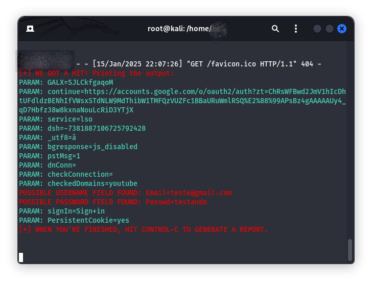

# Kali Linux - Desafio Phishing (versão clone Google)

Tipo de Ataque: **Social-Engineering Attacks**

Vetor de Ataque: **Web Site Attack Vectors**

Método de Ataque: **Credential Harvester Attack Method**

Método de Ataque: **Web Templates**, **Clone Google**

## Resultado: E-mail e senha capturados, conforme screenshot abaixo.

