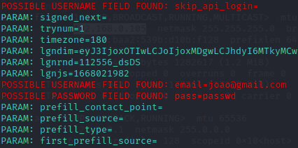

<<<<<<< HEAD
# Kali Linux - Desafio Phishing (versão clone Google)

Tipo de Ataque: **Social-Engineering Attacks**


Vetor de Ataque: **Web Site Attack Vectors**


Método de Ataque: **Credential Harvester Attack Method**


Método de Ataque: **Web Templates**, **Clone Google**

## Resultado: E-mail e senha capturados, conforme screenshot abaixo.


=======
# Phishing para captura de senhas do Facebook

### Ferramentas

- Kali Linux
- setoolkit

### Configurando o Phishing no Kali Linux

- Acesso root: ``` sudo su ```
- Iniciando o setoolkit: ``` setoolkit ```
- Tipo de ataque: ``` Social-Engineering Attacks ```
- Vetor de ataque: ``` Web Site Attack Vectors ```
- Método de ataque: ```Credential Harvester Attack Method ```
- Método de ataque: ``` Site Cloner ```
- Obtendo o endereço da máquina: ``` ifconfig ```
- URL para clone: http://www.facebook.com

### Resutados


>>>>>>> upstream/master
